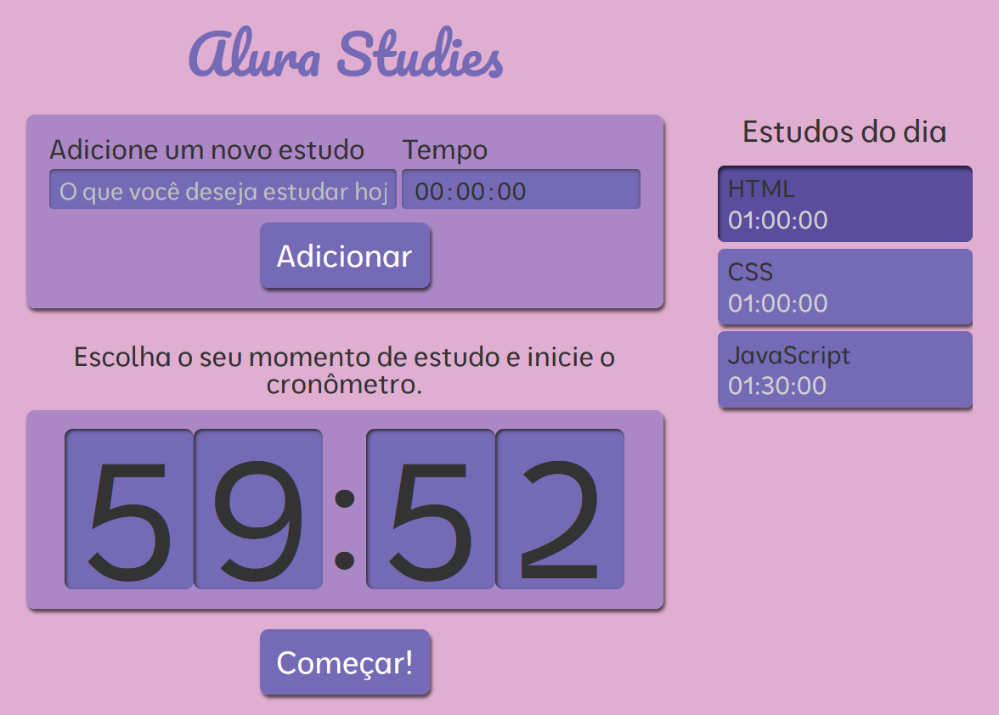

## 📚 Alura Studies

O **Alura Studies** é uma aplicação desenvolvida em **React com TypeScript** que ajuda na organização dos estudos. Você pode **adicionar o que deseja estudar, definir o tempo de dedicação e iniciar um contador** para manter o foco em cada atividade.

 

## 🚀 Sobre o Projeto

Este projeto foi desenvolvido durante o curso da Alura:

* "React: escrevendo com Typescript"
  
O **Alura Studies** tem como objetivo praticar a criação de aplicações **React com TypeScript** do zero, aplicando conceitos de **componentização, props e state**, além de boas práticas como **DRY (Don't Repeat Yourself) e SRP (Single Responsibility Principle)**. A aplicação utiliza **hooks (useState e useEffect) e CSS Modules** para manter o código organizado, limpo e modular.

## 📚 Objetivos do Curso

* Criar um projeto **React com Typescript** do zero com Create React App;
* Entender conceitos de React como **Componentização, Props e State**;
* Evitar sobreposições de CSS com **CSS Modules**;
* Aprender sobre os **hooks useState e useEffect** e entender como eles eram usados nos class components;
* Deixar o código mais limpo e documentado com a forma mais atual de se escrever React;
* Desenvolver código com conceitos de boas práticas como **DRY (Don't repeat yourself) e SRP (Single Responsibility Principle)**.

## 🛠️ Tecnologias Utilizadas

  

## 🖼️ Visualização do Projeto

Uma prévia das principais funcionalidades do **Alura Studies**:

**🌐 Acesse o Projeto Online**

O projeto está disponível para visualização na **Vercel**. Clique no link abaixo para acessar:

**📨 Página do Projeto**

Página inicial onde os usuários podem adicionar seus estudos, definir o tempo e acompanhar o contador em tempo real.

